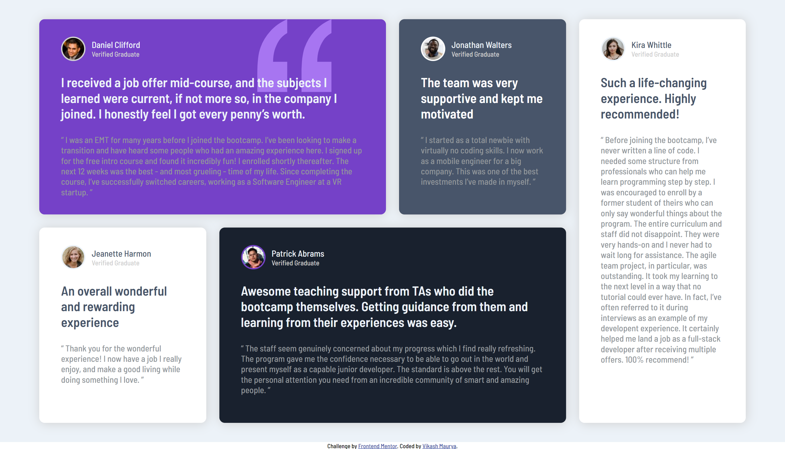
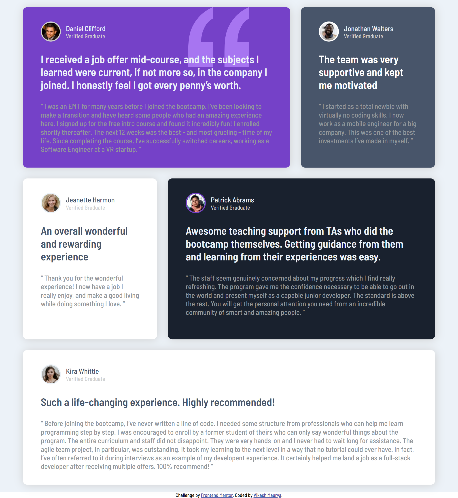
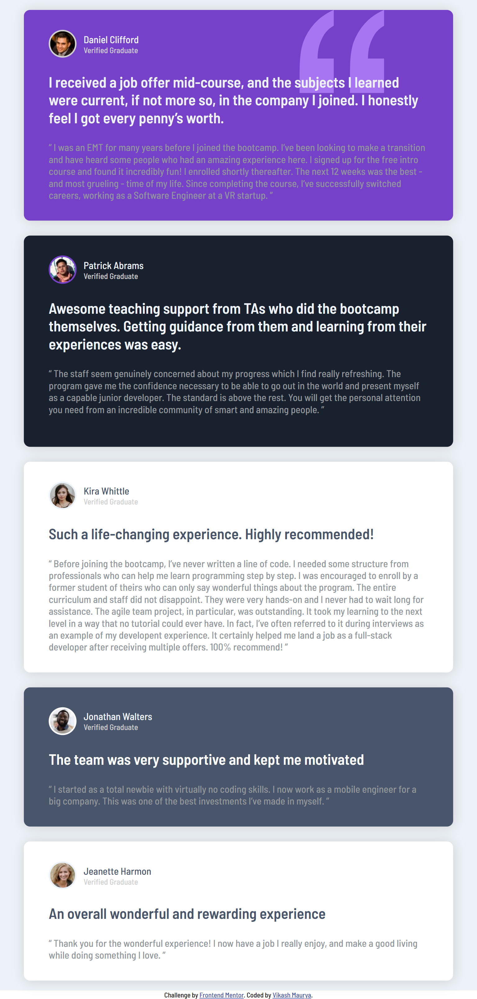
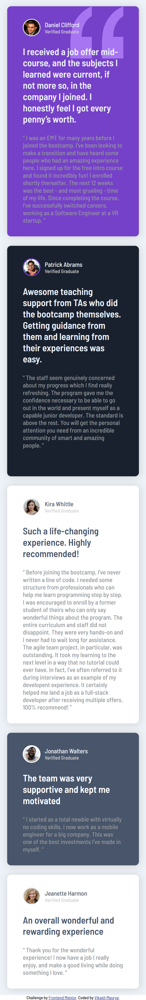

# Frontend Mentor - Testimonials grid section solution

This is a solution to the [Testimonials grid section challenge on Frontend Mentor](https://www.frontendmentor.io/challenges/testimonials-grid-section-Nnw6J7Un7).

## Table of contents

- [Overview](#overview)
  - [The challenge](#the-challenge)
  - [Screenshot](#screenshot)
  - [Links](#links)
- [My process](#my-process)
  - [Built with](#built-with)
  - [What I learned](#what-i-learned)
  - [Useful resources](#useful-resources)
- [Author](#author)

## Overview

### The challenge

Users should be able to:

- View the optimal layout for the site depending on their device's screen size

### Screenshot

| L-laptop screen                          | Laptop screen                          | Tablet screen                          | Mobile screen                          |
| ---------------------------------------- | -------------------------------------- | -------------------------------------- | -------------------------------------- |
|  |  |  |  |

### Links

- Solution URL: [get solution🌐](https://github.com/VikashMaurya10/testimonials-grid-section-main)
- Live Site URL: [view🌐](https://vikashmaurya10.github.io/testimonials-grid-section-main/)

## My process

### Built with

- Semantic HTML5 markup
- CSS custom properties
- Flexbox
- CSS Grid
- Mobile-first workflow

### What I learned

During completion of this project I've learned more **css grid** properties. I'm very glad to use grid to **create responsive design**. I recommend to all use the **css grid**.

To see how you can add code snippets, see below:

```css
.proud-of-this-css {
  display: grid;
  grid-template-columns: repeat(4, 1fr);
  grid-template-rows: repeat(2, 1fr);
  /* grid-column: 4/5; */
  /* grid-row: 4/5; */
}
```

### Useful resources

- [Figma](https://www.figma.com) - This helped me for measuring the actual design. I really liked this pattern and will use it going forward.

## Author

- website - [@vikashmaurya](https://github.com/VikashMaurya10/VikashMaurya10)
- Frontend Mentor - [@vikashmaurya](https://www.frontendmentor.io/profile/VikashMaurya10)
- LinkedIn - [@in-vikashmaurya](https://www.linkedin.com/in/in-vikashmaurya)
